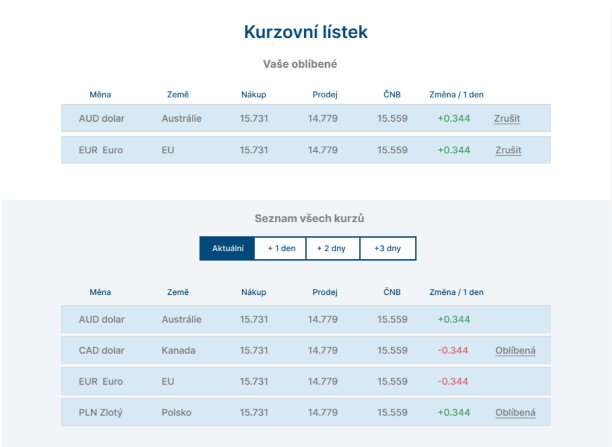

# ČS - Kurzovní lístek :money_with_wings:

## Getting Started

### Starting a local server

You need `node` (preferably the latest LTS version) and install node_modules:

```bash
npm install
```

then run:

```bash
npm run dev
```

Open [http://localhost:3000](http://localhost:3000) with your browser to see the result.
The application should automatically reload and show any changes made in the `src` folder.

### Check any lint errors in terminal

```bash
npm run lint
```

---------------------------------------------------------------------------
## Požadavky na aplikaci:

1. Vytvořte FE aplikaci (viz návrh níže) s výčtem kurzů vybraných měn na základě datového
souboru (data.json).
2. K datům v souboru se chovejte jako by šlo o výsledek api volání (může být např. vystaven
staticky a získáván z aplikace).
3. Uživatel si může libovolnou měnu označit jako oblíbenou. Seznam oblíbených měn by měl být
uložen v prohlížeči uživatele, aby uživatel (do smazání cache prohlížeče) tyto vybrané měny
stále viděl. Oblíbené měny jsou zobrazeny ve vlastním listu (viz. návrh) nad seznamem všech
kurzů.
4. V seznamu všech kurzů je možné zobrazit aktuální kurz ČNB nebo odhadovaný kurz na
následují den, dva dny nebo tři dny dle výběru uživatele (vždy ve sloupci ČNB).
a. Odhadovaný kurz ČNB se počítá jako součet aktuálního kurzu ČNB a změny (sloupec
změna / 1 den – parametr „move“) za uživatelem vybraný počet dní. Tzn. kurz ČNB je
počítán s předpokladem, že stoupá / klesá stejným tempem vybraný počet dní.
b. Parametr move je udávaný procentech změny za 1 den
c. Vybraný typ zobrazeného ČNB kurzu (aktuální / odhadovaný - viz bod výše)
promítněte do url tak, aby link na dané zobrazení byl přeposílatelný
5. Libovolným způsobem (např. barevně) musí být vyznačeno, zda kurz dané měny klesá /
stoupá.



### Technické požadavky:
- použijte knihovnu react.js v libovolném stacku
- použití typescriptu výhodou
- aplikace by měla obsahovat základní automatické testy (cypress, react-testing-library, jest -
dle Vaší preference)
- použijte git - aplikaci vystavte na libovolném public repositáři (github, gitlab, bitbucket, ...)

### JSON:
[
    {
        "shortName": "AUD",
        "name": "Dolar",
        "country": "Austrálie",
        "move": -0.3,
        "buy": 15.338,
        "sell": 16.125,
        "cnb": 15.776
    },
    {
        "shortName": "ZAR",
        "name": "Rand",
        "country": "JAR",
        "move": -0.51,
        "buy": 1.32,
        "sell": 1.388,
        "cnb": 1.36
    },
    {
        "shortName": "CAD",
        "name": "Dolar",
        "country": "Kanada",
        "move": -0.76,
        "buy": 17.129,
        "sell": 18.008,
        "cnb": 17.603
    },
    {
        "shortName": "CHF",
        "name": "Frank",
        "country": "Švýcarsko",
        "move": -0.38,
        "buy": 24.154,
        "sell": 25.392,
        "cnb": 24.846
    },
    {
        "shortName": "DKK",
        "name": "Koruna",
        "country": "Dánsko",
        "move": 0.15,
        "buy": 3.188,
        "sell": 3.351,
        "cnb": 3.269
    },
    {
        "shortName": "EUR",
        "name": "Euro",
        "country": "EU",
        "move": 0.16,
        "buy": 23.712,
        "sell": 24.928,
        "cnb": 24.32
    },
    {
        "shortName": "GBP",
        "name": "Libra",
        "country": "Velká Británie",
        "move": 1.17,
        "buy": 27.199,
        "sell": 28.594,
        "cnb": 27.801
    },
    {
        "shortName": "HKD",
        "name": "Dolar",
        "country": "Hongkong",
        "move": -0.3,
        "buy": 2.915,
        "sell": 3.065,
        "cnb": 2.987
    },
    {
        "shortName": "HRK",
        "name": "Kuna",
        "country": "Chorvatsko",
        "move": 0.22,
        "buy": 3.143,
        "sell": 3.304,
        "cnb": 3.224
    },
    {
        "shortName": "HUF",
        "name": "Forint",
        "country": "Maďarsko",
        "move": 1.11,
        "buy": 5.839,
        "sell": 6.139,
        "cnb": 5.998
    },
    {
        "shortName": "JPY",
        "name": "Jen",
        "country": "Japonsko",
        "move": 0.42,
        "buy": 16.394,
        "sell": 17.234,
        "cnb": 16.789
    },
    {
        "shortName": "NOK",
        "name": "Koruna",
        "country": "Norsko",
        "move": 0,
        "buy": 2.291,
        "sell": 2.408,
        "cnb": 2.349
    },
    {
        "shortName": "NZD",
        "name": "Dolar",
        "country": "Nový Zéland",
        "move": 0.03,
        "buy": 13.997,
        "sell": 14.714,
        "cnb": 14.393
    },
    {
        "shortName": "PLN",
        "name": "Zlotý",
        "country": "Polsko",
        "move": 0.41,
        "buy": 5.045,
        "sell": 5.304,
        "cnb": 5.168
    },
    {
        "shortName": "RON",
        "name": "Lei",
        "country": "Rumunsko",
        "move": 0.08,
        "buy": 4.831,
        "sell": 5.079,
        "cnb": 4.952
    },
    {
        "shortName": "SEK",
        "name": "Koruna",
        "country": "Švédsko",
        "move": 0.04,
        "buy": 2.192,
        "sell": 2.305,
        "cnb": 2.25
    },
    {
        "shortName": "TND",
        "name": "Dinar",
        "country": "Tunisko",
        "move": 2.06,
        "buy": 7.281,
        "sell": 7.654,
        "cnb": 0
    },
    {
        "shortName": "TRY",
        "name": "Lira",
        "country": "Turecko",
        "move": -0.48,
        "buy": 1.226,
        "sell": 1.289,
        "cnb": 1.256
    },
    {
        "shortName": "USD",
        "name": "Dolar",
        "country": "USA",
        "move": -0.43,
        "buy": 22.814,
        "sell": 23.984,
        "cnb": 23.379
    },
    {
        "shortName": "BGN",
        "name": "Lev",
        "country": "Bulharsko",
        "move": 0.16,
        "buy": 12.126,
        "sell": 12.747,
        "cnb": 12.432
    }
]